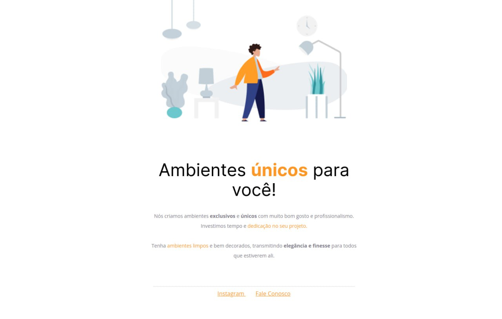

# Projeto 1 - Moveis Customizados

## 📚 O Projeto [DEMO](https://sabrinagomesb.github.io/rs-explorer/stage02-projeto01/)

Trabalhando o conceito de como alinhar texto e elementos, espaçamentos e estilo de fonte, construímos um site estático a partir desse modelo disponível no [Figma](<https://www.figma.com/file/IBoQPXMLKfVxFRJUctRPKP/Explorer---Projeto-01-(Copy)?node-id=0%3A1&t=Uzzmj4qvvpdMzvf3-0>).

  

