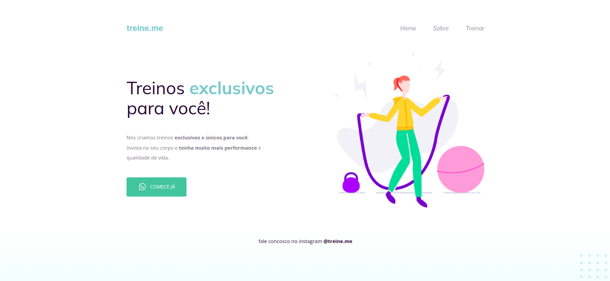

# Projeto 2 - Treine-me

## 📚 O Projeto [DEMO](https://sabrinagomesb.github.io/rs-explorer/stage02-projeto02/)

Nesse projeto são reforçados os conceitos trabalhados no primeiro projeto (alinhamento de texto e elementos, espaçamentos e estilo de fonte), porém introduz também novos conceitos como: Box Model e Flexbox no CSS e HTLM semântico com configuração de botão.

  

