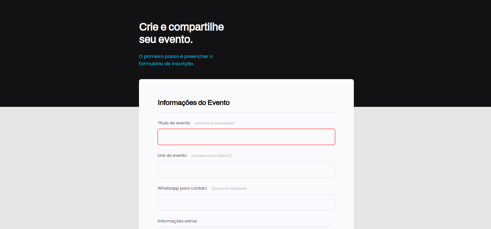

# Projeto 3 - Formulários

## 📚 O Projeto [DEMO](https://sabrinagomesb.github.io/rs-explorer/stage03-projeto03/)

Explora a criação e utilação de formulário, incluindo inputs, submit, validações e customização. Nesse projeto também são trabalhados conceitos consutmização com acessibilidade.

  

