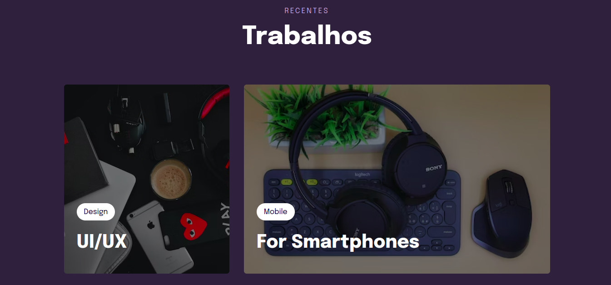

# Projeto 5 - Componentes de Trabalho

## 📚 O Projeto [DEMO](https://sabrinagomesb.github.io/rs-explorer/stage03-projeto05/)

Nesse projeto são aplicados recursos mais avançados do CSS como: variáveis; transições e transformações; animações; CSS Grid; CSS clamp e filtros em imagens.

  

