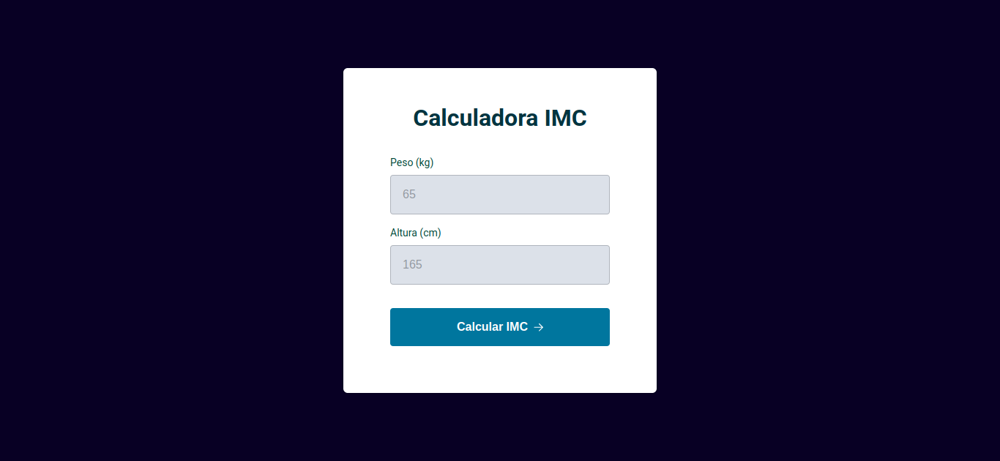
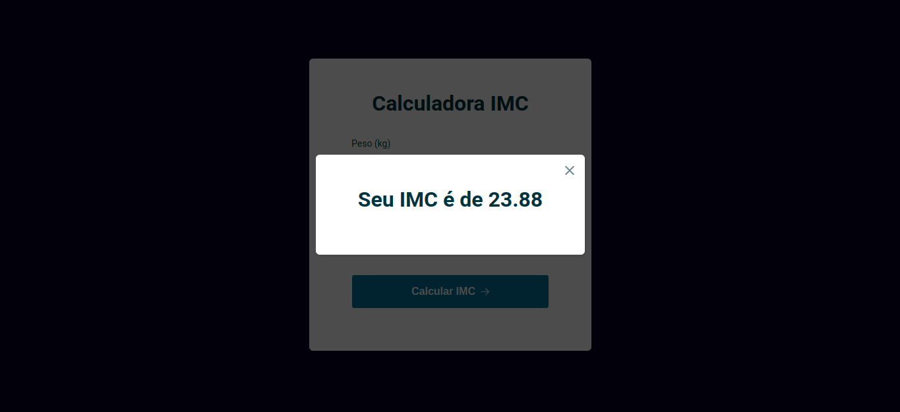

# Projeto 8 - Calculadora de IMC

## 📚 O Projeto [DEMO](https://sabrinagomesb.github.io/rs-explorer/stage05-projeto08/)

Construímos uma calculadora de IMC ao manipularmos os elementos da DOM e exibimos o resultado em um modal.

  
  

